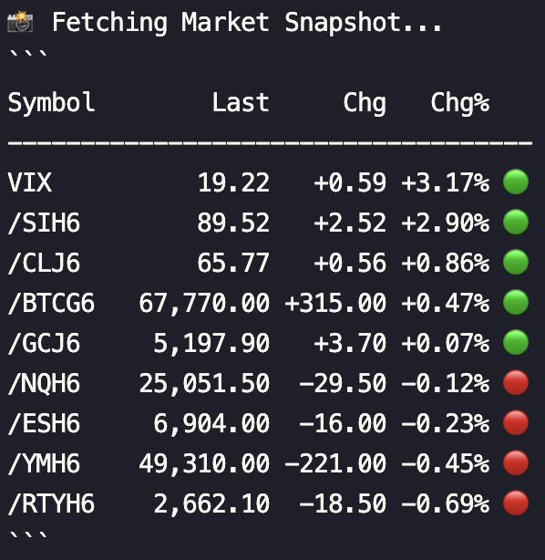
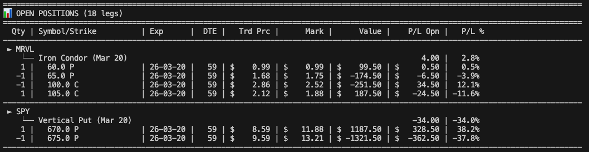

# Tasty-Coach

A Python trading assistant that connects to your Tastytrade account for IVR scanning, strategy screening, position review with roll analysis, risk management, and gamma exposure (GEX) analysis.

## Features

- Automated IVR scanning across watchlists with configurable thresholds
- Strategy screening for vertical credit spreads and iron condors
- Position review with roll scenario analysis (down, out, down-and-out)
- Portfolio risk management with buying power monitoring
- Gamma Exposure (GEX) analysis with regime detection
- Market snapshot for quick overnight checks
- Discord-formatted output for sharing
- Automated position monitoring with alerts

## Quick Start

### Prerequisites

- Python 3.10+
- A Tastytrade account with API access
- OAuth credentials (client secret + refresh token)

### Installation

1. Clone this repository:
```bash
git clone <repository-url>
cd tasty-coach
```

2. Install dependencies:
```bash
pip install -r requirements.txt
```

3. Set up your environment variables:
```bash
cp .env.example .env
# Edit .env with your Tastytrade OAuth credentials
```

4. Test your connection:
```bash
./venv/bin/python main.py --test-connection
```

5. Open the interactive launcher:
```bash
./venv/bin/python main.py

# or explicitly
./venv/bin/python main.py --menu
```

## Configuration

Create a `.env` file in the project root with your Tastytrade OAuth credentials:

```bash
# Tastytrade OAuth Credentials
TASTYTRADE_CLIENT_SECRET=your_client_secret
TASTYTRADE_REFRESH_TOKEN=your_refresh_token
TASTYTRADE_IS_TEST=false

# Scanner Configuration
IVR_THRESHOLD=25
LOG_LEVEL=INFO

# Optional Settings
CACHE_DURATION=300
MAX_RETRIES=3

# Account Selection (recommended if you have multiple accounts)
TASTY_ACCOUNT_NUMBER=your_account_number
```

### Configuration Options

| Variable | Description | Default |
|----------|-------------|---------|
| `TASTYTRADE_CLIENT_SECRET` | OAuth client secret | Required |
| `TASTYTRADE_REFRESH_TOKEN` | OAuth refresh token | Required |
| `TASTYTRADE_IS_TEST` | Use certification/sandbox environment | `false` |
| `IVR_THRESHOLD` | IVR percentage threshold for scanning | `25` |
| `LOG_LEVEL` | Logging level (DEBUG/INFO/WARNING/ERROR) | `INFO` |
| `CACHE_DURATION` | Data cache duration in seconds | `300` |
| `MAX_RETRIES` | Maximum API retry attempts | `3` |
| `TASTY_ACCOUNT_NUMBER` | Specific account to use (multi-account) | Auto-select |

## Usage

### Test Connection
```bash
./venv/bin/python main.py --test-connection
```

### Interactive Launcher
```bash
./venv/bin/python main.py
./venv/bin/python main.py --menu
```

The launcher opens as a keyboard-driven terminal UI in an interactive shell. Use the arrow keys or `j` / `k` to move, `Enter` to run the selected action, and `1-9`, `a`, or `q` for shortcuts.
It also refreshes the market status panel automatically, and the watchlist workflow now includes a searchable watchlist picker instead of a raw text prompt.
Function keys are also mapped: `F1` toggles help, `F2` refreshes the home screen, `F3` opens watchlist workflow, `F4` shows market status, `F5` shows portfolio health, and `F10` quits.
The watchlist picker now uses fuzzy matching, previews symbols for the highlighted watchlist before selection, and the IVR scan runs in a split-pane live results view.
The position review flow asks for an underlying symbol first, so typing `NVDA` reviews an open NVDA position directly; pressing Enter falls back to a picker sourced from open positions.
The market snapshot flow now uses the same symbol picker, so `--snapshot` is no longer a watchlist-only prompt.

### List Watchlists
```bash
./venv/bin/python main.py --list-watchlists
```

### Scan a Watchlist for High IVR
```bash
./venv/bin/python main.py --watchlist "My Watchlist"

# With custom threshold
./venv/bin/python main.py --watchlist "High IV Plays" --threshold 30
```

### Market Snapshot
Get a quick price snapshot from a watchlist named "Snapshot" in your Tastytrade platform.

```bash
./venv/bin/python main.py --snapshot
```



### Check Market Status
```bash
./venv/bin/python main.py --market
```

### Account Report
```bash
./venv/bin/python main.py --report

# Discord formatting
./venv/bin/python main.py --report --discord
```



### Portfolio Health Check
```bash
./venv/bin/python main.py --health
```

### Review Positions & Roll Scenarios
```bash
# Review positions for a specific underlying
./venv/bin/python main.py --review-position SLV

# Export to JSON
./venv/bin/python main.py --review-position SLV --output slv_review.json

# Discord formatting
./venv/bin/python main.py --review-position SLV --discord
```

Roll scenario tables show proposed legs with action and option side, such as `BTO 25P / STO 30P / STO 45C / BTO 50C`, rather than ambiguous min/max strike pairs. Strike-shift roll scenarios are currently limited to single options and same-type verticals; iron condors receive roll-out scenarios until side-specific iron-condor roll logic is implemented.

### Full Scan Workflow (Watchlist + Strategy Screening)
```bash
# Scan watchlist, check risk, screen strategies
./venv/bin/python main.py --watchlist "My Watchlist"

# Override risk manager blocks
./venv/bin/python main.py --watchlist "My Watchlist" --force
```

### Debug Mode
```bash
./venv/bin/python main.py --debug --watchlist "Test List"
```

### Multi-Account
```bash
./venv/bin/python main.py --account 5WW46136 --report
```

## CLI Reference

| Flag | Description |
|------|-------------|
| `--watchlist, -w NAME` | Scan a watchlist for high IVR symbols + screen strategies |
| `--health` | Portfolio health check (risk metrics only) |
| `--threshold, -t PCT` | Override IVR threshold (default: 25%) |
| `--test-connection, -c` | Test API connectivity |
| `--list-watchlists, -l` | List available watchlists |
| `--menu` | Open the interactive launcher |
| `--market, -m` | Check market session status |
| `--snapshot, -s` | Market snapshot from "Snapshot" watchlist |
| `--report, -r` | Generate account positions report |
| `--review-position SYMBOL` | Review position with roll scenarios |
| `--output, -o FILE` | Export results to JSON file |
| `--discord, -d` | Format output for Discord |
| `--account NUMBER` | Select specific account |
| `--force` | Override risk manager blocks |
| `--debug, -D` | Enable debug logging |

## Project Structure

```
tasty-coach/
├── agents/
│   ├── scanner.py          # IVR scanning & watchlist resolution
│   ├── portfolio.py        # Position tracking & reporting
│   ├── strategy.py         # Strategy screening (verticals, iron condors)
│   ├── reviewer.py         # Position review & roll scenario analysis
│   ├── manager.py          # Risk management & portfolio health
│   └── gex.py             # Gamma Exposure (GEX) analysis
├── utils/
│   ├── tasty_client.py     # OAuth authentication & session management
│   ├── roll_calculator.py  # Pure roll scenario calculations
│   ├── market_schedule.py  # Market session & hours checking
│   └── dx_feed.py         # Real-time data streaming (dxLink)
├── tests/
│   └── test_risk_manager.py
├── docs/                   # Screenshots & images
├── main.py                 # Entry point & CLI orchestrator
├── position_monitor.py     # Automated position monitoring
├── position_monitor.sh     # Bash wrapper for monitor
├── requirements.txt
├── .env                    # OAuth credentials (not committed)
├── .env.example            # Credential template
└── CLAUDE.md               # AI agent instructions
```

## Project Status

Currently in **Phase 5** (Enhancement & Optimization):

- **Phase 1**: Setup & Authentication
- **Phase 2**: Watchlist Integration
- **Phase 3**: Market Data & IVR Calculation
- **Phase 4**: Scanning Logic & Output
- **Phase 5** (current): Position Reviewer, Risk Management, Strategy Screening, GEX Analysis

## Troubleshooting

### Authentication Issues
1. Verify your OAuth credentials in `.env`
2. Ensure `TASTYTRADE_CLIENT_SECRET` and `TASTYTRADE_REFRESH_TOKEN` are set
3. For test environment, use certification/sandbox credentials
4. Run `./venv/bin/python main.py --test-connection` to diagnose

### Common Errors
- **"Required environment variable not set"**: Check your `.env` file
- **"Authentication failed"**: Verify OAuth credentials
- **"Connection test failed"**: Check network connectivity and API status
- **414 Request-URI Too Large**: Market data requests are batched (~50 symbols); report if this persists

## API Rate Limits

The application implements intelligent rate limiting:
- Automatic retry with exponential backoff
- Configurable maximum retry attempts
- Data caching to reduce API calls (60s for market schedule, configurable for others)
- Batched market data requests (~50 symbols per request)

## Security

- Credentials stored in environment variables (`.env`, never committed)
- OAuth refresh tokens for session management
- Sensitive data excluded from logs

## License

This project is for educational and personal use. Please comply with Tastytrade's Terms of Service and API usage guidelines.
